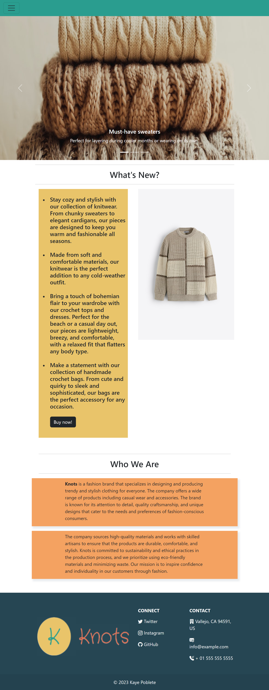

# Capstone Project 1

Built an E-Commerce website using HTML, CSS, JavaScript, and Bootstrap.

## Features

1. Navigation bar: The Nav Bar is stickied to the top when scrolling. Active page is highlited. Tab changes color when hovering.
2. Index/Main page: View slides that shows images. Paragraphs about the "company" and its products.
3. Products page: Image banner. Product information, including images, descriptions, and pricing.
4. Sign Up page: Form to fill out user information (First name, Last name, Username, Password, Password confirmation). Radios to answer question. Checkboxes. Input validation.
5. Log In page: Form to fill out log in information, including username and password. Checkbox to remember.
6. Checkout page: Form to fill out billing, delivery, and payment information. Displays cart. Input validation.
7. Footer: Logo. Social media links. Contact Information.

## Page Views

Index Page View:


Products Page View:


Sign Up Page:


Log In Page View:


Checkout Page View:


## Usage/Examples

```CSS
.card {
    margin-bottom: 40px;
    transition: all 0.2s ease;
    cursor: pointer;
}

/* CSS for when hovering over cards */
.card:hover {
    box-shadow: 5px 6px 6px 2px #e9ecef;
    transform: scale(1.1)
}
```
Effect on the cards on Product Page when mouse hovers over them using CSS.
## Authors

Kaye Poblete
- [@kayepoblete](https://www.github.com/kayepoblete)

